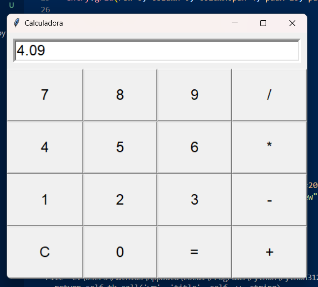

# Interfaz gráfica Tkinter

En el presente directorio, se utilizó el módulo Tkinter para crear una interfaz gráfica para una calculadora.

(Explicacion)

## Instrucciones de uso

¿Qué hay que tener instalado para ejecutar el programa? ¿Qué comando utilizar?
'''
py calculadora.py
'''
## Demostración de ejecución

  

